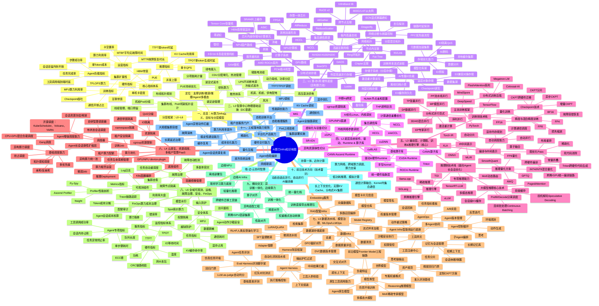

知识地图

```mermaid
mindmap
  root((AI算力Infra知识地图))
    一、总览：AI算力Infra定义、目标与分层模型
      定位：支撑训练/微调/推理/Agent/多模态
      核心指标体系
        硬件指标
          TFLOPS算力
          HBM带宽
          互联带宽
          PUE
          单机卡密度
        训练指标
          MFU算力利用率
          Checkpoint吞吐
          通信开销占比
          集群扩展性
        推理指标
          TTFT首token时延
          TPOT单token生成时延
          KV Cache利用率
          单卡QPS
          并发上限
        Agent负载指标
          任务完成率
          步骤成功率
          会话驻留内存开销
          工具调用端到端时延
        运营指标
          算力利用率
          卡空置率
          单Token成本
          MTBF平均无故障时间
          MTTR故障恢复时长
      分层框架：L0~L6
    二、L0 智算中心物理基础设施（DC基建）
      机房、机柜、供电配电
        高压直流供电
        UPS不间断电源
        储能电池组
        动力母线、功率分区
      散热体系
        风冷
        冷板式液冷
        浸没式液冷
        CDU分配单元、热池管理
      集群布线、Pod/机架拓扑设计
        机柜Pod分组
        布线拓扑规划
        线缆管理、端口预留
      绿色算力
        绿电接入
        分项能耗计量
        PUE持续优化
        碳足迹管理
    三、L1 算-存-网 硬件底座（异构算力池）
      计算子系统
        GPU路线
          NVIDIA H100/H200
          AMD ROCm系列
        NPU国产路线
          昇腾
          寒武纪
          壁仞
          沐曦
        其他加速形态
          FPGA
          ASIC
          存算一体芯片
        芯片内部存储与计算单元
          HBM高带宽显存
          SRAM片上缓存
          Tensor Core张量核
          NPU计算核
        服务器形态
          SXM整机
          PCIe插卡机型
          8卡/16卡高密度整机柜
      高速互联网络
        节点内互联
          NVLink
          Chiplet互联
          板内高速总线
        跨节点互联
          InfiniBand IB
          RoCE v2
          800G/1.6T以太网
        网络拓扑
          Fat-Tree
          Dragonfly
          Ring环拓扑
          分层混合拓扑
        集合通信原语
          NCCL
          HCCL
          AllReduce
          AllGather
          ReduceScatter
        网络诊断与拥塞控制
          PFC优先级流控
          ECN显式拥塞通知
          丢包探测
          链路时延探测
      存储子系统（分层存储）
        热层高速并行存储
          Lustre
          BeeGFS
          DAOS
          分布式块存储
        温层对象存储
          S3兼容对象存储
          模型仓库湖
          数据集湖
        冷层归档存储
          离线归档介质
          备份库
        AI专属IO负载
          训练样本流式读取
          Checkpoint读写
          KV缓存持久化
          激活重计算读写
        存储优化能力
          元数据加速集群
          IO预取
          本地缓存集群
          数据分片
          纠删码
          IO隔离QoS
    四、L2 底层系统软件、驱动、Runtime & 算子库
      AI优化Linux、内核调优
        NUMA节点亲和配置
        THP透明巨页
        cgroup资源隔离
        中断irq绑定
        内核网络参数调优
      驱动&硬件Runtime
        CUDA Runtime
        ROCm Runtime
        CANN Ascend Runtime
        统一硬件抽象层
      基础算子库
        cuDNN
        cuBLAS
        CANN算子库
        Triton
        手写Kernel
      集合通信库
        NCCL
        HCCL
        oneCCL
        计算通信重叠优化
      虚拟化与设备切分
        GPU/NPU直通
        MIG
        vGPU
        SR-IOV
        异构资源弹性切分
    五、L3 编译层、计算图、训练&推理引擎（核心）
      编译与中间表示
        IR中间表示
          ONNX
          MLIR
          Torch IR
          XLA
        图优化Pass
          算子融合
          常量折叠
          布局重排
          死代码消除
          稀疏化
        自动调度能力
          自动并行
          自动分片
          显存内存规划
          计算通信调度
        跨硬件编译
          昇腾/GPU统一编译链路
          Triton跨硬件代码生成
      训练侧技术栈
        分布式并行范式
          DP数据并行
          MP模型并行
          PP流水线并行
          TP张量并行
          EP专家并行
          3D/4D混合并行
          序列并行
          激活重计算
        主流训练框架
          PyTorch
          TensorFlow
          MindSpore
        分布式训练后端
          DeepSpeed
          Megatron-LM
          Colossal-AI
          FlashAttention系列
        Checkpoint技术
          增量CKPT
          异步CKPT
          CKPT分片
          CKPT跨硬件迁移
          故障容错恢复
        精度与混合精度训练
          FP16
          BF16
          FP8
          FP4
          量化训练
          损失缩放
      推理侧技术栈（面向Agent长会话优化）
        推理引擎
          vLLM
          SGLang
          TensorRT-LLM
          TGI
          llama.cpp
          昇腾推理引擎
        大模型推理核心技术
          PagedAttention
          连续批处理Continuous Batching
          Prefill/Decode分离调度
          投机解码Speculative Decoding
          前缀缓存
          会话级KV缓存
        推理量化方案
          GPTQ
          AWQ
          SmoothQuant
          FP8量化
          INT4/INT8混合量化
        专项推理能力
          稀疏推理
          MoE动态路由
          多模态推理
    六、L4 云原生、资源调度、多租户智算PaaS
      底座组件
        K8s容器编排
        容器镜像管理
        GPU/NPU device-plugin
      调度器
        开源调度：KubeScheduler、Volcano、YARN
        自研智算调度器
        基础调度能力
          Gang调度
          拓扑感知调度
          亲和/反亲和
          抢占调度
          多优先级
          异构算力调度
        Agent增强调度能力
          有状态会话调度
          会话资源冻结/释放
          CPU-GPU混合负载调度
      资源隔离
        cgroup资源限制
        namespace隔离
        QoS分级
        IO隔离
        通信带宽隔离
      任务生命周期管理
        训练Job
        微调Job
        推理Deployment
        Agent长会话弹性扩缩容
      算力池化
        异构算力统一池
        租户算力配额
        租户安全隔离
        算力租赁运营
    七、L5 数据流水线、模型治理、MLOps/LLMOps
      数据Infra
        数据湖存储底座
        DVC数据版本管理
        数据清洗
        去重
        数据质量评估
        流式样本加载
      模型仓库
        Model Registry
        权重版本管理
        模型签名
        模型卡片元信息
      微调流水线
        SFT监督微调
        DPO偏好对齐
        RLHF人类反馈强化学习
        LoRA/QLoRA
        Adapter管理
      前沿模型Frontier Model工程链路
        模型类型
          Reasoning推理模型
          Agent原生模型
          MoE稀疏专家模型
          世界模型
          多模态大模型
        负载特征
          超长上下文
          思考链输出
          原生工具调用能力
          交互式对齐
          仿真环境训练
        资产规范
          专属权重格式
          定制CKPT方案
          准入评测基线
          精度回归门禁
      Agent Infra智能体运行底座
        Agent控制循环
          思考
          动作生成
          环境观测
          反思迭代
        记忆与会话管理
          短期上下文
          长期记忆库
          子Agent编排
          任务分片
          会话休眠/唤醒
        工具网关
          工具注册中心
          沙箱安全执行
          权限管控
          动作重试策略
          多Agent协同
        AgentOps
          Agent版本管理
          A/B实验
          会话回放
          任务指标看板
      Harness驾驭框架
        Agent Harness
          上下文组装
          工具入参校验
          输出护栏过滤
          中间结果拦截
          执行策略控制
        Eval Harness评测脚手架
          基础基准评测
          Agent任务评测
          LLM-as-judge自动判分
          自动化评测流水线
          红队对抗测试
          回归门禁
          仿真任务环境
      RAG配套Infra
        向量数据库
        检索集群
        Embedding服务
        多路召回编排
    八、L6 全域可观测、运维、故障治理、安全、FinOps
      监控指标体系
        硬件指标
          温度
          功耗
          ECC错
          CRC链路校验
          网卡丢包
        任务指标
          MFU
          显存占用
          通信耗时
          IO等待时间
          KV缓存命中率
        服务指标
          TTFT
          TPOT
          错误率
          队列长度
        Agent专项指标
          单步骤耗时
          工具调用成功率
          任务异常终止率
          会话内存占用
      可观测组件
        Metrics指标
        Trace链路追踪
        Log日志
        Profiler性能剖析
          Nsight
          Ascend Profiler
          Py-Spy
      故障治理
        故障自动检测
        故障节点隔离
        任务自动重调度
        集群自愈
        多副本容灾
      安全体系
        模型水印
        数据脱敏
        访问鉴权
        权限隔离
        输入防护
        越狱防护
        Agent动作沙箱安全
      FinOps算力成本治理
        算力账单
        利用率大盘
        Spot竞价算力
        配额审计
        Token成本分摊
        Agent会话成本核算
    九、横向交叉：异构适配、训推一体化、边缘算力
      异构适配工程
        昇腾/GPU混部集群
        算子对齐
        精度对齐
        性能对齐
        跨硬件迁移工具链
      训推一体化
        训练直接导出推理包
        权重格式自动转换
        统一量化栈
      边缘AI Infra
        边缘NPU
        轻量化推理
        离线部署包
        联邦学习算力底座
    十、前沿技术方向（技术雷达）
      存算一体、近存计算
      通信计算融合、Kernel内集合通信
      动态自适应并行、自动并行AI编译器
      长上下文优化、无限KV Cache、分布式KV集群
      低功耗推理、模拟计算
      算力网络、跨域算力调度、算力交易
      端-边-云协同智算
    十一、工程落地能力矩阵
      硬件交付能力
        集群部署实施
        Pod上线验收
        网络联调
        液冷系统运维
      性能调优能力
        MFU调优
        通信优化
        显存优化
        KV Cache调优
        TTFT/TPOT调优
        Agent全链路调优
      稳定性建设能力
        大规模集群容错
        长尾延迟治理
        故障演练
        Agent异常动作拦截
      平台化产品能力
        自助训练平台
        自助推理服务
        Agent自助编排
        租户自服务门户
      成本优化能力
        算力利用率提升
        量化压缩
        稀疏化
        缓存复用
        Agent会话资源复用
```